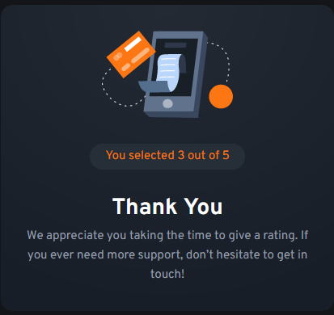

  <!-- First Image -->
  

  <!-- Second Image -->
  

# Links

- Solution URL: [GitHub Code]('https://github.com/Lazzzare/InteractiveRatingComponent-React-')
- Live Site URL: [Live Site]('https://64d00fc3dad64a06542baa79--grand-rabanadas-8c608d.netlify.app/')

# Built With

- _React_
- _Typescript (TSX)_
- _React Hooks (useState)_
- _TailwindCss_

# Author

> - _GitHub_ - [Lazzzare](https://github.com/Lazzzare).
> - _Linkedin_ - [Lazare Chkhartishvili](https://www.linkedin.com/in/lazare-chkhartishvili-0a6434235/).
